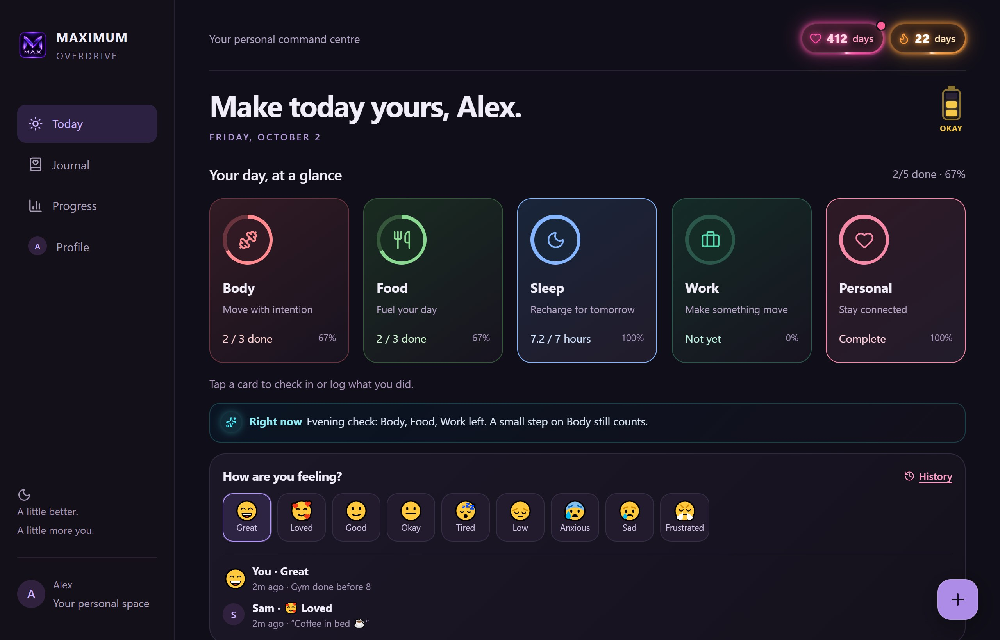
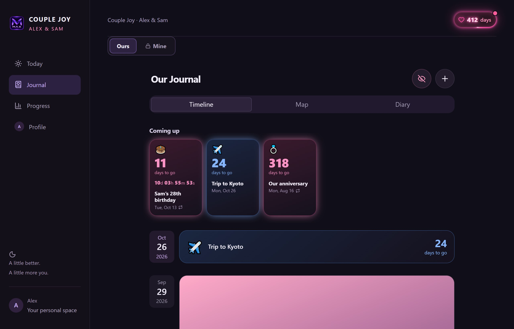
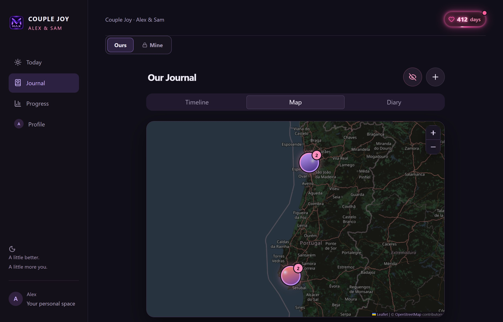
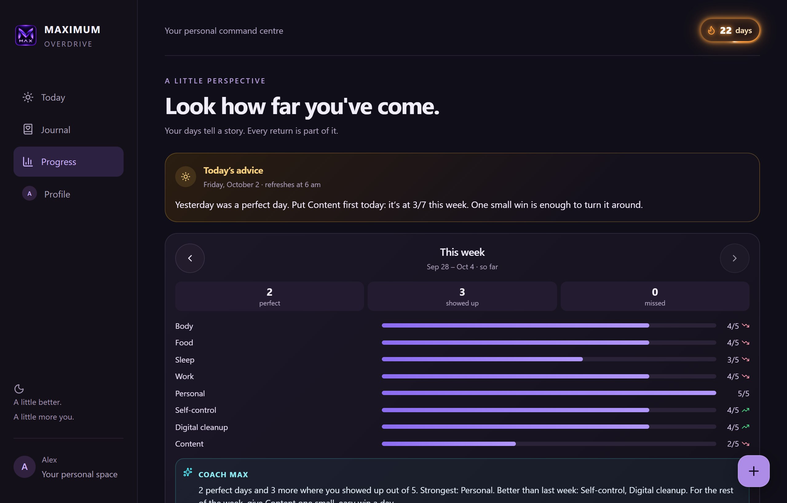
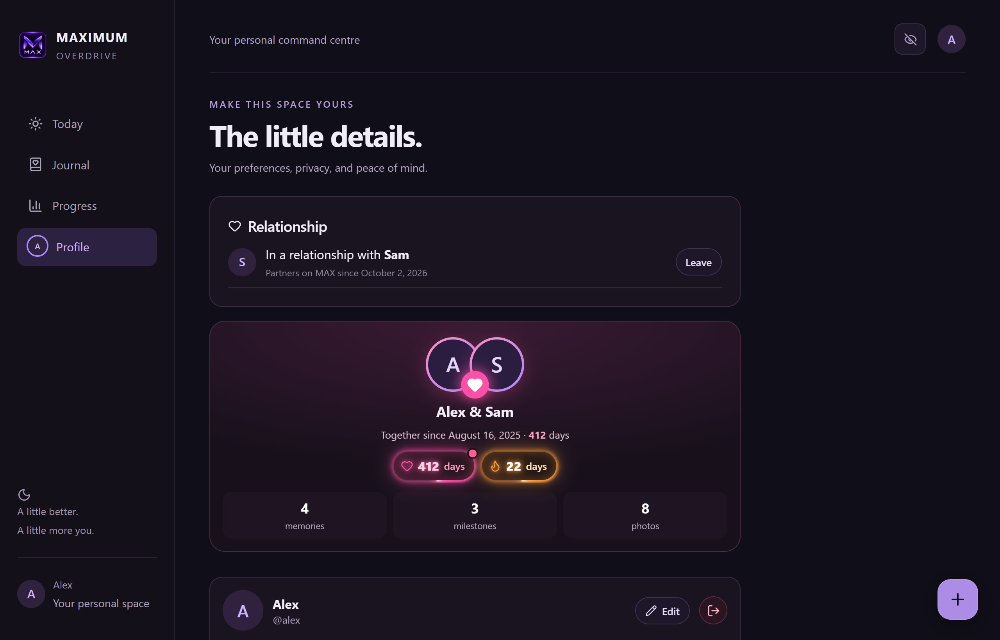
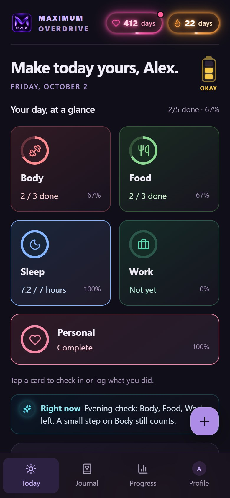
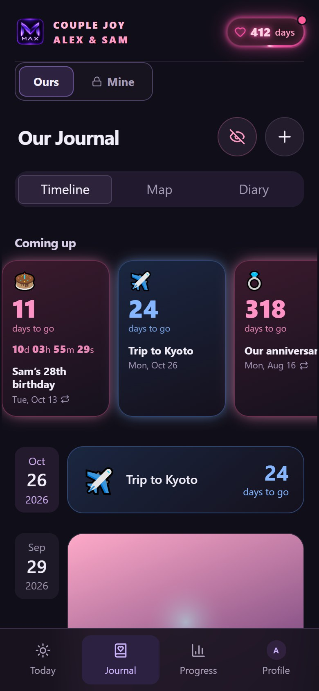

# Maximum Overdrive

[](https://github.com/Maxy747/maximum-overdrive/actions/workflows/ci.yml)

A self-hosted, phone-first personal tracker: daily goals, habits and streaks, with a private journal, an optional
shared journal for couples, and an optional AI coach. One Node server, one SQLite file, your own hardware.

- **Track your day:** goals as checklists, counts, durations, "any one of" or choices; flexible weekly goals, rest days,
  low-energy days and stretch days; streaks with monthly streak freezes; reminders, a sleep plan and meal windows.
- **See progress:** history by day, weekly recap, per-goal streaks, a long-term weight goal with weekly weigh-ins.
- **Journal (everyone):** memories with photos, date, time and place; a map of where they happened; a diary;
  a photo dump; countdowns and milestones; your mood. Only you can see it, and you can lock it with a PIN.
- **Partners (optional):** invite your partner with a code to get a shared journal, a daily question you both answer,
  shared moods and gentle notifications. Your own journal stays private.
- **Hidden photos:** a PIN-locked album per person.
- **M.A.X. coach (optional):** check-ins, daily advice and "log it for me" from a chat, using any OpenAI-compatible
  model (Ollama, llama.cpp, LM Studio, Groq, OpenRouter, OpenAI, Gemini) or a local llama.cpp model.
- **Works like an app:** add it to your home screen, get push notifications, keep using it offline and sync later.

## Screenshots



| Shared journal | Memory map |
|---|---|
|  |  |
| **Progress** | **Profile and partner** |
|  |  |

<p align="center">
  
  &nbsp;&nbsp;
  
</p>

All example data (two partners, Alex and Sam). Run `npm run demo` to click around it yourself.

## Quick start (Docker)

```bash
git clone https://github.com/Maxy747/maximum-overdrive.git
cd maximum-overdrive
cp .env.example .env
docker compose up -d
```

Open <http://localhost:4317> and create the first account; it becomes the admin. Data lives in the `max-data`
volume. By default the port is only published on `127.0.0.1`: put a reverse proxy in front for HTTPS (see
[docs/deploy.md](docs/deploy.md)), and set `MAX_ORIGIN` in `.env` to the address people will open.

Push notifications, "Add to Home Screen" and secure cookies need HTTPS on a real domain (or `localhost`).

## Without Docker

Needs Node.js 24.

```bash
npm ci
cp .env.example .env        # for local development, add MAX_DEV_MODE=1
npm run build
npm start                   # http://localhost:4317
```

Accounts can also be managed on the server:

```bash
node selfhost-dist/server.mjs set-password alex "Alex"
```

Other commands: `list-users`, `set-avatar <username> <image>`, `restore-days <username> <backup.sqlite> <day>...`.

## Configuration

Everything is set with environment variables; [.env.example](.env.example) lists and explains all of them.
The ones you're most likely to change:

| Variable | Default | What it does |
|---|---|---|
| `MAX_ORIGIN` | (required) | The address people open, e.g. `https://max.example.com` |
| `MAX_SIGNUP` | `invite` | `invite` (a partner's code is needed), `open` or `closed` |
| `MAX_SMTP_URL`, `MAX_MAIL_FROM` | (none) | Email for sign-up codes and password resets |
| `MAX_FEATURES` | `vault,coach` | Turn hidden photos or the coach off for everyone |
| `MAX_COACH_URL`, `MAX_COACH_API_KEY`, `MAX_COACH_MODEL_NAME` | (none) | The coach's model; see [docs/coach.md](docs/coach.md) |
| `MAX_BASE_PATH` | (none) | Serve under a sub-path like `/max` |
| `MAX_ALLOWED_LOGIN` | (none) | Only let these Tailscale identities reach the app |

## How accounts and privacy work

- **Accounts:** sign up with a name, email and password, and confirm the email with a 6-digit code. Log in with email or
  username; reset a forgotten password by email. Passwords are hashed with scrypt; sessions are random tokens stored
  hashed, in `HttpOnly`, `SameSite=Strict` cookies. Five wrong passwords lock that account's login for five minutes.
  Every change request must come from `MAX_ORIGIN`.
- **Who sees what:** your tracker, your own journal, your hidden photos and your coach chats are only ever sent to
  you. Your partner sees the shared journal, the moods you mark as shared and your daily answers (after answering
  their own). Nobody else on the server sees anything of yours, not even your name (unless the admin turns on the
  "Who's here?" account list, `MAX_ACCOUNT_PICKER`). This is enforced by the server and covered by the tests.
- **Partner invites:** 8-character codes, single use, valid 48 hours, stored hashed, rate-limited. Leaving a partner
  hides the shared journal from both of you without deleting it; pairing again brings it back.
- **PIN locks:** hidden photos and (if you turn it on) your own journal need your PIN; an unlock lasts 15 minutes.
- **What this doesn't protect against:** data is not encrypted at rest; anyone with access to the server's files can
  read it. The app keeps an offline copy of your data and recently seen photos in the browser, so a PIN protects
  against someone opening the app, not against full access to an unlocked phone. "Hide private goals" only hides
  them on screen.
- **Third parties:** the map loads tiles from OpenStreetMap and looks up places with Nominatim. The coach, if you set
  one up with a hosted API, sends that person's goals and notes for the day to it. Email goes through your SMTP
  provider, and push notifications through the browser's push service (Apple, Google or Mozilla). Nothing else
  leaves your server.

## Backups

Everything is in the data folder: `max.sqlite` and `files/`. Back up both, using SQLite's online backup for the
database so you get a consistent copy while it's running:

```bash
sqlite3 data/max.sqlite ".backup 'backup/max.sqlite'" && cp -r data/files backup/
```

With Docker, stop the container briefly and archive the volume:

```bash
docker compose stop && docker run --rm -v maximum-overdrive_max-data:/data -v "$PWD":/backup busybox tar czf /backup/max-backup.tgz -C /data . && docker compose start
```

 In the app, **Export everything**
(Profile) downloads a zip of your own data, your journals and the photos you can see.

## Development

```bash
npm run dev          # build, then start with .env
npm run demo         # a throwaway server full of example data (http://localhost:4340)
npm test             # end-to-end tests against a real server and database (no mocks)
npm run typecheck
```

Layout:

- `app/`: the React app (Vite, Tailwind, shadcn/ui components in `components/ui/`)
- `lib/`: logic shared by the app and the server (goals, streaks, reminders, validation)
- `selfhost/server.mjs`: the HTTP server (Node's `http` and `node:sqlite`, no framework);
  `accounts.mjs` sign-up and email, `spaces.mjs` journals and partners, `coach.mjs` the model, `mail.mjs` SMTP
- `tests/`: `selfhost.mjs` (the app), `accounts.mjs` (sign-up and email), `spaces.mjs` (journals, partners, privacy)
- `scripts/build-selfhost.mjs`: builds the app and bundles the server into `selfhost-dist/`
- `scripts/demo.mjs`: example data for trying the app; `scripts/screenshots.mjs` retakes the README screenshots
  from it (`npm run demo`, then `npm run screenshots`)

## Limits

- One server, one SQLite file: meant for you, your partner and a few friends, not thousands of users.
- 3 MB of tracker data per person, 10 MB per upload.
- Push notifications on iPhone need iOS 16.4+ and the app added to the Home Screen.

## Security

See [SECURITY.md](SECURITY.md) for how to report a vulnerability.

## License

[MIT](LICENSE)
